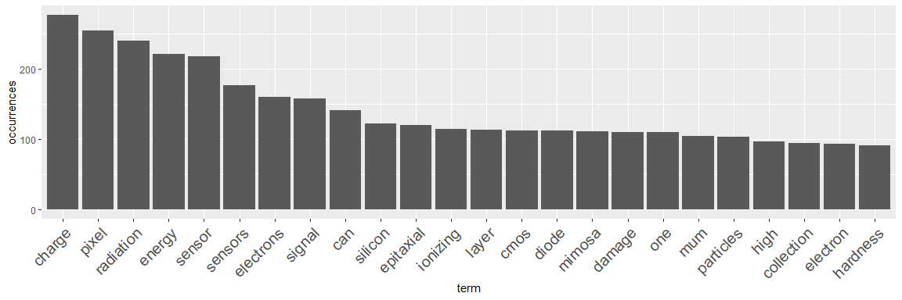

PhD Thesis Analysis
================
Benjamin Linnik

Just for fun, text analysis of my thesis. Practice on (small) big data analysis.
Can be quickly adapted to analyse any other kind of documents. Download the code from the repo and adjust the path variables. Maybe some filter adjustment is necessary for your use case.

``` r
# #######################
# ###### LIBRARIES ######
# #######################
library(tm) # text processing
```

    ## Warning: package 'tm' was built under R version 3.4.4

    ## Loading required package: NLP

``` r
library(RWeka) # machine learning lib
```

    ## Warning: package 'RWeka' was built under R version 3.4.4

``` r
library(ggplot2) # plotting
```

    ## Warning: package 'ggplot2' was built under R version 3.4.4

    ## 
    ## Attaching package: 'ggplot2'

    ## The following object is masked from 'package:NLP':
    ## 
    ##     annotate

``` r
library(wordcloud)
```

    ## Warning: package 'wordcloud' was built under R version 3.4.4

    ## Loading required package: RColorBrewer

``` r
# #############################
# ##### OUTPUT FILE NAMES #####
# #############################

# Document source, here all my *.tex files are stored (only the *.tex files)
inputDir <- paste0("F:/Eigene Dateien/Promotion/Linnik-PhD-final/chapter")

wd     <- paste0(getwd()) # working dir
word_predictor   <- paste0(wd, "/processed/pred/")
dir_en_processed <- paste0(wd, "/processed/cleanTxt/")
dir_en_freq      <- paste0(wd, "/processed/freq/")

dir.create (word_predictor, recursive = TRUE)
```

    ## Warning in dir.create(word_predictor, recursive = TRUE): 'F:\Eigene Dateien
    ## \Documents\knitr example\processed\pred' existiert bereits

``` r
dir.create (dir_en_processed, recursive = TRUE)
```

    ## Warning in dir.create(dir_en_processed, recursive = TRUE): 'F:\Eigene
    ## Dateien\Documents\knitr example\processed\cleanTxt' existiert bereits

``` r
dir.create (dir_en_freq, recursive = TRUE)
```

    ## Warning in dir.create(dir_en_freq, recursive = TRUE): 'F:\Eigene Dateien
    ## \Documents\knitr example\processed\freq' existiert bereits

``` r
BIGRAM_FNAME   <- paste0(word_predictor, "bigram.txt")
TRIGRAM_FNAME  <- paste0(word_predictor, "trigram.txt")
QUADGRAM_FNAME <- paste0(word_predictor, "quadgram.txt")

PROCESSED_CORPUS_FNAME <- paste0(dir_en_processed, "processed_corpus.txt")
TERM_FREQ_VECTOR_FNAME <- paste0(dir_en_freq, "term_freq_vector.txt")
TERM_FREQ_MATRIX_FNAME <- paste0(dir_en_freq, "term_freq_matrix.txt")
TERM_FREQ_NAMES_FNAME  <- paste0(dir_en_freq, "term_freq_names.txt")
TERM_FREQ_ORDERED_VECTOR_FNAME <- paste0(dir_en_freq, "term_freq_ord_vector.txt")

#specifies the exact folder where my LaTeX file(s) is for analysis with tm.
docs  <- Corpus(DirSource(directory = inputDir, encoding = "UTF-8"), readerControl = list(language = "en", reader = readPlain))
summary(docs)  #check what went in
```

    ##                        Length Class             Mode
    ## _00_Acronyms.tex       2      PlainTextDocument list
    ## _04_MAPS.tex           2      PlainTextDocument list
    ## _06_Requirements.tex   2      PlainTextDocument list
    ## _06_Results.tex        2      PlainTextDocument list
    ## 00_Abstract.tex        2      PlainTextDocument list
    ## 00_Acronyms.tex        2      PlainTextDocument list
    ## 00_Erklaerung.tex      2      PlainTextDocument list
    ## 00_glossary.tex        2      PlainTextDocument list
    ## 01_Motivation.tex      2      PlainTextDocument list
    ## 02_CBM.tex             2      PlainTextDocument list
    ## 03_Semiconductors.tex  2      PlainTextDocument list
    ## 04__bigtables.tex      2      PlainTextDocument list
    ## 04_Damage.tex          2      PlainTextDocument list
    ## 05_Countermeasures.tex 2      PlainTextDocument list
    ## 06_FastNeutrons.tex    2      PlainTextDocument list
    ## 07_ColdNeutrons.tex    2      PlainTextDocument list
    ## 08_HeavyIons.tex       2      PlainTextDocument list
    ## 10_Appendix.tex        2      PlainTextDocument list
    ## Thanks.tex             2      PlainTextDocument list

Now cleanup the read text

``` r
# #######################
# ###### CONSTANTS ######
# #######################

# Set textual patterns
BLANK_SPACE <- " "

Comments_Pattern <- "\\%.*"
NumbersOnly_Pattern <- "\\s*(?<!\\B|-)\\d+(?!\\B|-)\\s*"
# FILTER_PATTERN_01 <- "[^a-zA-Z 0-9']"
SpecialChars_Pattern <- "[^\\w ]"
FILTER_PATTERN_02 <- "( don | doesn | wasn | weren | re | ve | m | s | t )"
LaTex_Pattern <- "([a-zA-Z]*section |chapter |item|vfill|clearpage|begin|end|label|table|centering|tabular|caption |cref |acs |textbf|(sub)*figure|textwidth|text |fig|cite|acro|[0-9]+pt|images|therefore|sidenote|chap)"

SINGLE_CHARACTER_PATTERN <- "^([^aiIlr] )|( [^aiIlr] )|( [^aiIlr])$"
REPEAT_CHARACTER_PATTERN <- " (.)\\1{1,} "

# #######################
# ###### FUNCTIONS ######
# #######################

# Create the toSpace content transformer
toSpace <- content_transformer( 
               function(x, pattern) { return (gsub(pattern, BLANK_SPACE, x, perl = TRUE)) } )

# Abstract the NGramTokenizer function 
ngramTokenizer <- function(x, n, m) NGramTokenizer(x, Weka_control(min = n, max = m))

# Create interfaces for bigrams and trigrams
bigramTokenizer   <- function(x) ngramTokenizer(x, 2, 2)
trigramTokenizer  <- function(x) ngramTokenizer(x, 3, 3)
quadgramTokenizer <- function(x) ngramTokenizer(x, 4, 4)
```

``` r
# #######################
# #### DATA CLEANING ####
# #######################
# Set all Corpus text to lower case
docs <- tm_map(docs,content_transformer(tolower))

# Remove all comment lines
docs <- tm_map(docs, toSpace, Comments_Pattern)

# Replace all characters not forming part of FILTER_PATTERN_01 with a blank space
docs<- tm_map(docs, toSpace, SpecialChars_Pattern)

# Replace all characters not forming part of FILTER_PATTERN_01 with a blank space
docs<- tm_map(docs, toSpace, NumbersOnly_Pattern)

# Remove any remaining punctuation
docs <- tm_map(docs, removePunctuation)

# Remove truncated forms of the verbs "to do", "to be", and "to have"
docs <- tm_map(docs, toSpace, FILTER_PATTERN_02)

# Remove english stop words
docs <- tm_map(docs, removeWords, stopwords("english"))

# Remove common LaTeX commands
docs <- tm_map(docs, toSpace, LaTex_Pattern)

# Replace all single character words not forming of SINGLE_CHARACTER_PATTERN with a blank space
docs <- tm_map(docs, toSpace, SINGLE_CHARACTER_PATTERN)

# Strip white space
docs <- tm_map(docs, stripWhitespace)
```

Time to find often used word combinations. They are called n-grams. We will look for 2-grams to 4-grams. The data gathered could be used to do sentance prediction while typing.

``` r
# ###############################
# #### N-GRAM MODEL CREATION ####
# #### can be used to predict ###
# # what phrases are often used #
# ###############################
docs_en <- docs

# Create a bigram, remove repetitions, save it to disk, and free up memory
bigram <- bigramTokenizer(docs_en)
bigram <- unique(bigram)
write.table(bigram, BIGRAM_FNAME, row.names = FALSE, col.names = FALSE)
rm(bigram); nohup <- gc(verbose = FALSE)

# Create a trigram, remove repetitions, save it to disk, and free up memory
trigram <- trigramTokenizer(docs_en)
trigram <- unique(trigram)
write.table(trigram, TRIGRAM_FNAME, row.names = FALSE, col.names = FALSE)
rm(trigram); nohup <- gc(verbose = FALSE)

# Create a quadgram, remove repetitions, save it to disk, and free up memory
quadgram <- quadgramTokenizer(docs_en)
quadgram <- unique(quadgram)
write.table(quadgram, QUADGRAM_FNAME, row.names = FALSE, col.names = FALSE)
rm(quadgram); nohup <- gc(verbose = FALSE)

# Save tsamples in order to create a new, refined Corpus
write.table(docs_en[1:length(docs_en)]$content, PROCESSED_CORPUS_FNAME, row.names = FALSE, col.names = FALSE, quote = FALSE)

# Free up memory
rm(docs_en); nohup <- gc(verbose = FALSE)
```

Woe we will count the frequencies of words

``` r
# ########################################
# #### TERM FREQUENCY VECTOR CREATION ####
# ########################################

# Create a new Corpus with clean data for text files in EN
docs_en  <- Corpus(DirSource(dir_en_processed), readerControl = list(reader = readPlain)) 

# Create the Document Term Matrix (DTM)
dtm <- DocumentTermMatrix(docs_en)
dim(dtm)
```

    ## [1]    1 4293

A big matrix, let's reduce it. 4293 unique words.

``` r
# IMPORTANT: Remove the least frequent terms. There are many sparse terms 
# (mostly with frequencies between 1 - 9) that are useless
dtm <- DocumentTermMatrix(docs_en, list(dictionary=findFreqTerms(dtm, 10)))
dim(dtm)
```

    ## [1]   1 516

``` r
# Free up memory by removing the Corpus. Not needed anymore
rm(docs_en); nohup <- gc(verbose = FALSE)
```

Much better, only 516 most often used words left. In case you have read more than one document, the first number will be different from 1.

``` r
# IMPORTANT: Remove the least frequent terms. There are many sparse terms 
# (mostly with frequencies between 1 - 9) that are useless
dtm_withoutSparseTerms <- removeSparseTerms(dtm, 0.3)

# inspect the matrix
t(inspect(dtm_withoutSparseTerms)[1,])
```

    ## <<DocumentTermMatrix (documents: 1, terms: 516)>>
    ## Non-/sparse entries: 516/0
    ## Sparsity           : 0%
    ## Maximal term length: 26
    ## Weighting          : term frequency (tf)
    ## Sample             :
    ##                       Terms
    ## Docs                   can charge electrons energy pixel radiation sensor
    ##   processed_corpus.txt 141    277       160    221   255       241    218
    ##                       Terms
    ## Docs                   sensors signal silicon
    ##   processed_corpus.txt     177    158     122

    ##      can charge electrons energy pixel radiation sensor sensors signal
    ## [1,] 141    277       160    221   255       241    218     177    158
    ##      silicon
    ## [1,]     122

``` r
# Calculate the cumulative frequencies of words across documents [FREQUENCY VECTOR]
freqr <- colSums(as.matrix(dtm_withoutSparseTerms))

# Free up memory
rm(dtm); rm(dtm_withoutSparseTerms); nohup <- gc(verbose = FALSE)
```

In the bottom row we allready see the most frequent words. The list is not ordered yet.

``` r
# Create sort vector in descending order of frequency
ordr <- order(freqr, decreasing=TRUE)

# create data frame with ordered frequencies, if data is too big, skip this operation
freqr_df <- data.frame(freqr[ordr])

# Write vectors to disk
freqr_names <- names(freqr)

write.table(freqr_df, paste0(TERM_FREQ_MATRIX_FNAME), row.names = TRUE, col.names = FALSE, quote = FALSE)
write.table(freqr, TERM_FREQ_VECTOR_FNAME, row.names = FALSE, col.names = FALSE, quote = FALSE)
write.table(freqr_names, TERM_FREQ_NAMES_FNAME, row.names = FALSE, col.names = FALSE, quote = FALSE)
write.table(ordr,  TERM_FREQ_ORDERED_VECTOR_FNAME, row.names = FALSE, col.names = FALSE, quote = FALSE)

# Free up memory
rm(freqr_df); nohup <- gc(verbose = FALSE)
```

Now we have written the word usages into files. After saving our results on the harddrive, lets do some plotting!



And here the famous word cloud.

A wordcloud can be used to distinguish one kind of text type from another very quickly. Modern spam filters can for example predict if a mail is a spam mail by analyzing the most frequently used words in a mail and comparing its wordcloud to the wordcloud of not-spam mails.

Use the word-frequencies and the gathered information to create an individual fingerprint for your documents. Categorize them quickly with your trained machine learning model. 

``` r
wf <- data.frame(term=names(freqr),occurrences=freqr)
pal <- brewer.pal(8, "Dark2")
wordcloud(words = wf$term, freq = wf$occurrences, min.freq = 70, colors = pal,random.order = FALSE, scale=c(3,0.5))
```


I hope you had fun :)
